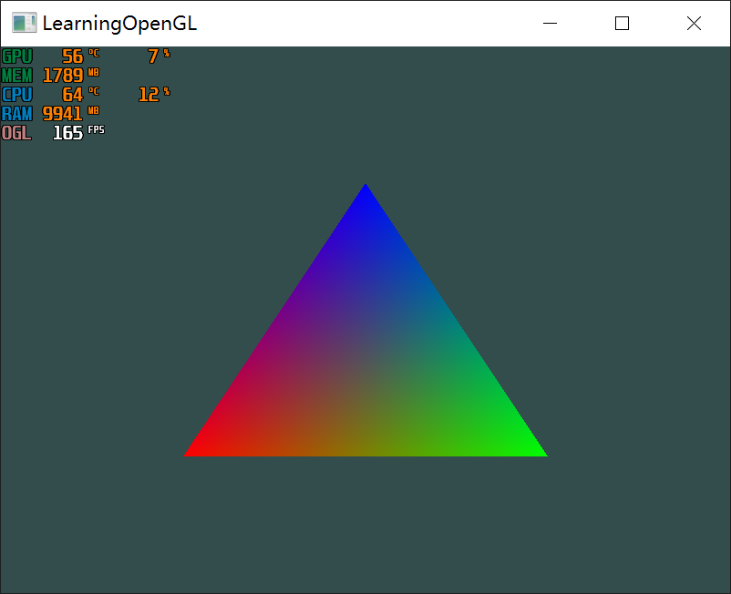

# LearnOpenGL CN 着色器 2022.11.4
## GLSL
1. 着色器的开头总是要声明版本，接着是输入和输出变量、uniform和main函数。每个着色器的入口点都是main函数，在这个函数中我们处理所有的输入变量，并将结果输出到输出变量中。
2. 一个典型的着色器有以下几个结构
```C
#version version_number
in type in_variable_name;
in type in_variable_name;

out type out_variable_name;

uniform type uniform_name;

int main()
{
  // 处理输入并进行一些图形操作
  ...
  // 输出处理过的结果到输出变量
  out_variable_name = weird_stuff_we_processed;
}
```
3. 顶点着色器接受顶点数据，在`in`前添加`layout`标识通过`location`指定数据
   1. 可以通过`glGetAttribLocation`来确定某一属性的顶点数据位置
   2. 但建议在配置顶点数据时手动指定`location = num`，可以提高效率
4. Uniform
   1. Uniform是一种从CPU中的应用向GPU中的着色器发送数据的方式，但uniform和顶点属性有些不同。首先，uniform是全局的(Global)。全局意味着uniform变量必须在每个着色器程序对象中都是独一无二的，而且它可以被着色器程序的任意着色器在任意阶段访问。第二，无论你把uniform值设置成什么，uniform会一直保存它们的数据，直到它们被重置或更新。
   2. 如果你声明了一个uniform却在GLSL代码中没用过，编译器会静默移除这个变量，导致最后编译出的版本中并不会包含它，这可能导致几个非常麻烦的错误，记住这点！
   3. 在代码中更新指定Uniform的流程
      1. 使用`glGetUniformLocation()`查询其位置
      2. 使用`glUniform*()`更新他，*为后缀，有
      
## 添加更多的顶点数据
顶点数组定义如下
```C
float vertices[] =
{//顶点位置x, y, z 颜色r, g, b
    -0.5f, -0.5f, 0.0f, 1.0f, 0.0f, 0.0f,
     0.5f, -0.5f, 0.0f, 0.0f, 1.0f, 0.0f,
     0.0f,  0.5f, 0.0f, 0.0f, 0.0f, 1.0f
};
```
声明顶点属性
```C
// 位置属性
glVertexAttribPointer(0, 3, GL_FLOAT, GL_FALSE, 6 * sizeof(float), (void*)0);
glEnableVertexAttribArray(0);
// 颜色属性
glVertexAttribPointer(1, 3, GL_FLOAT, GL_FALSE, 6 * sizeof(float), (void*)(3* sizeof(float)));
glEnableVertexAttribArray(1);
```

最终效果


代码
```C
#include <glad/glad.h>
#include <GLFW/glfw3.h>
#include <iostream>
const char* vertexShaderSource =
"#version 330 core\n"
"layout (location = 0) in vec3 aPos;\n"
"layout (location = 1) in vec3 aColor;\n"
"out vec4 ourColor;\n"
"void main()\n"
"{\n"
"   gl_Position = vec4(aPos.x, aPos.y, aPos.z, 1.0f);\n"
"   ourColor = vec4(aColor.r, aColor.g, aColor.b, 1.0f);\n"
"}\0";

const char* fragmentShaderSource =
"#version 330 core\n"
"in vec4 ourColor;\n"
"out vec4 FragColor;\n"
"void main()\n"
"{\n"
"   FragColor = ourColor;\n"
"}\0";

float vertices[] =
{
    -0.5f, -0.5f, 0.0f, 1.0f, 0.0f, 0.0f,
     0.5f, -0.5f, 0.0f, 0.0f, 1.0f, 0.0f,
     0.0f,  0.5f, 0.0f, 0.0f, 0.0f, 1.0f
};

void framebuffer_size_callback(GLFWwindow* window, int width, int height)
{
    glViewport(0, 0, width, height);
}

void processInput(GLFWwindow* window)
{
    if (glfwGetKey(window, GLFW_KEY_ESCAPE) == GLFW_PRESS)
        glfwSetWindowShouldClose(window, true);
}

int main()
{
    glfwInit();
    glfwWindowHint(GLFW_CONTEXT_VERSION_MAJOR, 3);
    glfwWindowHint(GLFW_CONTEXT_VERSION_MINOR, 3);
    glfwWindowHint(GLFW_OPENGL_PROFILE, GLFW_OPENGL_CORE_PROFILE);
    GLFWwindow* window = glfwCreateWindow(800, 600, "LearningOpenGL", NULL, NULL);
    if (window == NULL)
    {
        std::cout << "Failed to create GLFW window" << std::endl;
        glfwTerminate();
        return -1;
    }
    glfwMakeContextCurrent(window);
    if (!gladLoadGLLoader((GLADloadproc)glfwGetProcAddress))
    {
        std::cout << "Failed to initialize GLAD" << std::endl;
        return -1;
    }
    glViewport(0, 0, 800, 600);
    glfwSetFramebufferSizeCallback(window, framebuffer_size_callback);
    unsigned int vertexShader;
    vertexShader = glCreateShader(GL_VERTEX_SHADER);
    glShaderSource(vertexShader, 1, &vertexShaderSource, NULL);
    glCompileShader(vertexShader);
    int success;
    char infoLog[512];
    glGetShaderiv(vertexShader, GL_COMPILE_STATUS, &success);
    if (!success)
    {
        glGetShaderInfoLog(vertexShader, 512, NULL, infoLog);
        std::cout << "ERROR::SHADER::VERTEX::COMPILATION_FAILED\n" << infoLog << std::endl;
    }
    unsigned int fragmentShader;
    fragmentShader = glCreateShader(GL_FRAGMENT_SHADER);
    glShaderSource(fragmentShader, 1, &fragmentShaderSource, NULL);
    glCompileShader(fragmentShader);
    glGetShaderiv(fragmentShader, GL_COMPILE_STATUS, &success);
    if (!success)
    {
        glGetShaderInfoLog(fragmentShader, 512, NULL, infoLog);
        std::cout << "ERROR::SHADER::FRAGMENT::COMPILATION_FAILED\n" << infoLog << std::endl;
    }
    unsigned int shaderProgram;
    shaderProgram = glCreateProgram();
    glAttachShader(shaderProgram, vertexShader);
    glAttachShader(shaderProgram, fragmentShader);
    glLinkProgram(shaderProgram);
    glGetProgramiv(shaderProgram, GL_LINK_STATUS, &success);
    if (!success)
    {
        glGetProgramInfoLog(shaderProgram, 512, NULL, infoLog);
        std::cout << "ERROR::SHADER::PROGRAM::LINK_FAILED\n" << infoLog << std::endl;
    }
    glUseProgram(shaderProgram);
    glDeleteShader(vertexShader);
    glDeleteShader(fragmentShader);
    unsigned int VBO, VAO;
    glGenBuffers(1, &VBO);
    glGenVertexArrays(1, &VAO);
    glBindVertexArray(VAO);
    glBindBuffer(GL_ARRAY_BUFFER, VBO);
    glBufferData(GL_ARRAY_BUFFER, sizeof(vertices), vertices, GL_STATIC_DRAW);
    glVertexAttribPointer(0, 3, GL_FLOAT, GL_FALSE, 6 * sizeof(float), (void*)0);
    glEnableVertexAttribArray(0);
    glVertexAttribPointer(1, 3, GL_FLOAT, GL_FALSE, 6 * sizeof(float), (void*)(3 * sizeof(float)));
    glEnableVertexAttribArray(1);
    while (!glfwWindowShouldClose(window))
    {
        processInput(window);
        glClearColor(0.2f, 0.3f, 0.3f, 1.0f);
        glClear(GL_COLOR_BUFFER_BIT);
        glBindVertexArray(VAO);
        glDrawArrays(GL_TRIANGLES, 0, 3);
        glfwSwapBuffers(window);
        glfwPollEvents();
    }
    glfwTerminate();
    return 0;
}
```