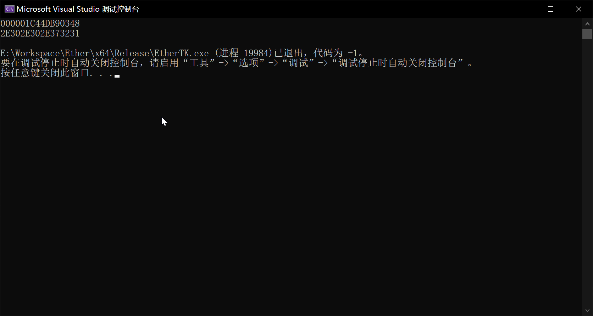

# 2023.3.5 要注意变量生存周期
cpp-HTTPlib中有服务端响应Get请求的函数，用法如下
```C++
httplib::Server svr.
svr.Get("/", [](const httplib::Request& req, httplib::Response& res) {
    res.set_content("Hello World", "text/plain");
});
```
这会注册一个回调函数，在服务器收到客户端`Get"/"`请求时执行

将其封装到Lua层，刚开始的实现如下
```C
ETHER_API int EAPI_Network_HTTPServerGet(lua_State* pLuaVM)
{
    ...//检查参数传入是否正确
	int refKey = luaL_ref(pLuaVM, LUA_REGISTRYINDEX);//将函数注册到Lua注册表
	pServer->Get(pPath, [&](const Request& req, Response& res) {
        lua_rawgeti(pLuaVM, LUA_REGISTRYINDEX, refKey)//从注册表中取出来
		...//执行一些操作
	});
	return 0;
}
```
但是执行时如下代码时
```Lua
local ETK = require("EtherTK")
local svr = ETK.Network.CreateHTTPServer()

svr:get("/", function(req, res)
        res:set_content("hello world", "text/plain")
    end)
svr:listen("127.0.0.1", 1234)
```
一旦有客户端发送`GET"/"`请求即出错，后来通过输出`pLuaVM`的前后地址发现其地址不一致，如图
```C
ETHER_API int EAPI_Network_HTTPServerGet(lua_State* pLuaVM)
{
    ...
    printf("%p\n", pLuaVM);//注册回调时的地址
	int refKey = luaL_ref(pLuaVM, LUA_REGISTRYINDEX);
	pServer->Get(pPath, [&](const Request& req, Response& res) {//重点在'&'
        printf("%p\n", pLuaVM);//执行回调时的地址，前后不一致
        lua_rawgeti(pLuaVM, LUA_REGISTRYINDEX, refKey)
		...
	});
	return 0;
}
```

得到错误原因为Lamda表达式中的按引用捕获


原因很简单，<u><b>在回调函数被执行的时候，注册回调函数的函数早已执行完毕，其中的pLuaVM和refKey参数或变量早已被析构，故执行时出错</b></u>
## 结论
- 将按引用捕获"&"改成赋值捕获"="即可避免变量被析构
- 一定要注意变量的生存周期，特别是回调函数中捕获变量析构的问题
- Ether中可以通过宏来切换生成dll或者exe
## 出错图片

