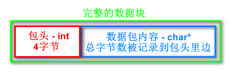

# 如何解决TCP流式传输的粘包问题 2023.09.24-09.27
## 什么导致了粘包问题

首先需明确的是，<b>粘包问题不是传输层TCP协议的问题</b>，其根本原因在于TCP是**流式传输**的，而我们的数据往往是以**不定长的数据包**的形式发送的，于是多个数据包就可能同时传输到对方，如果不加以解决的话对方会无法解析传输过来的数据。所以，需要在<b>应用层</b>使用相关协议，解决粘包问题。

## 解决方案
1. 使用现成的应用层协议（如HTTP）
2. 在包头和包尾加上特殊字符标记结束（需要一个字节一个字节判断，效率低）
3. <b>在包头加上定长的头部来表示当前数据包的数据段长度</b>，（如4个字节的包头最大可以表示长度为2^8 - 1个字节的数据段）


## 如何发送和接收

### 发送

发送数据时只需要在数据前加上包头即可，在实践中仅进行了Windows平台上的TCP通讯，按理来说如果跨平台需要考虑到数据类型的**大小端**问题

### 接收

事实上，不符合预期的情况只有两种，即**包在头部被切断**和**包在主体被切断**，而且，只有接受到的最后一个包会发生这两种情况（也可能第一个包就被切断）

于是，只需要写三个函数来分别处理三个情况
1. `解包完整的包()`；
2. `解包在body被切断的包();`
   1. 先读取头部，创建临时缓存（防止这个包过大）
   2. 调用`Recv()`接收这个包剩下的数据（注意接收长度一定要是**包体剩下的长度**，如果多接收了数据会出错，接受位置一定要**后移**，不然会覆盖掉已经有的部分头部）
   3. `解包完整的包();`
3. `解包在header被切断的包();`
   1. 将部分header复制到缓存的开头
   2. 调用`Recv()`接收头部剩下的数据（注意事项同上）
   3. 读取头部，创建临时缓存（防止这个包过大）
   4. 将完整头部复制到临时缓存（具体看解包实现是否需要头部）
   5. 调用`Recv()`接受body到临时缓存（注意不要覆盖头部）
   6. `解包完整的包();`

伪代码实现如下，这里使用了一个currentPos变量来记住当前读取到的位置，**注意操作时一定要记得及时更新`currentPos`**

```C++
#define HEADER_LENGTH sizeof(unsigned int)
#define BUFFER_SIZE 1024
// BUFFER_SIZE是一次性能接收的最多数据
data_size = TCP_Recv(sock, buffer, BUFFER_SIZE);
// currentPos代表下一个要处理的字节
currentPos = 0;
/* 如果包是完整的 */
while (currentPos + HEADER_LENGTH + length <= BUFFER_SIZE && currentPos != data_size) 
{
    ...// 解包完整的包
    currentPos += (HEADER_LENGTH + length);
}
/* 如果最后一个包在body被切断 */
if (BUFFER_SIZE - currentPos > HEADER_LENGTH)
{
    // 读取包头，分配临时的缓存(防止包的长度超过了BUFFER_SIZE)
    len = *header;// 读取包头
    temp_buffer = malloc(len + HEADER_LENGTH);//记得调用free();
    // 把buffer中剩余的部分copy到temp_buffer
    memcpy(temp_buffer, buffer + currentPos, BUFFER_SIZE - currentPos);
    // 接受包被切掉的部分
    TCP_Recv(sock, temp_buffer + (BUFFER_SIZE - currentPos), len + HEADER_LENGTH - (BUFFER_SIZE - currentPos));
    ...// 解包完整的包
}
/* 如果最后一个包在header被切断 */
else
{
    /* 先想办法把完整的header接收过来 */
    // 把buffer剩余的部分拷贝到buffer的开头
    memcpy(buffer, buffer + currentPos, BUFFER_SIZE - currentPos);
    // 接受包剩下的头部
    TCP_Recv(sock, buffer + BUFFER_SIZE - currentPos, HEADER_LENGTH - (BUFFER_SIZE - currentPos));
    // 读取包头，分配临时的缓存(防止包的长度超过了BUFFER_SIZE)
    len = *header;// 读取包头
    temp_buffer = malloc(len + HEADER_LENGTH);//记得调用free();
    // 复制包头到临时缓存
    memcpy(temp_buffer, len, HEADER_LENGTH);
    // 接受包体到临时缓存
    TCP_Recv(sock, temp_buffer + HEADER_LENGTH, len);
    ...// 解包完整的包
}

```

## 实践

采用SDL_Net作为基础网络库进行了实现，这个库对Windows平台的TCP、UDP进行了简单的封装

[TCPWarper.hpp](./Code/TCPWarper.hpp)

## 参考
* [TCP数据粘包的处理](https://subingwen.cn/linux/tcp-data-package/)
* [【TCP/IP】Nagle 算法以及所谓 TCP 粘包](https://www.cnblogs.com/jojop/p/14376423.html)